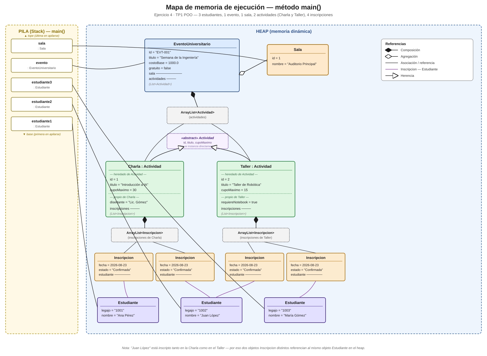

# TP1 - Programación Orientada a Objetos en Java

Trabajo Práctico N°1 de la cátedra **Paradigmas de Programación** (UTN - FRM), Unidad 1: Fundamentos de la POO e implementación básica en Java.

## Estado actual

| Ejercicio | Descripción | Estado |
|---|---|---|
| 1 | Clase `EventoUniversitario`: creación, copia y contador de instancias | ✅ Completo |
| 2 | Relaciones entre `EventoUniversitario`, `Sala`, `Actividad`, `Estudiante` e `Inscripcion` | ✅ Completo |
| 3 | Herencia y polimorfismo (`Actividad` abstracta, subclases `Charla` y `Taller`) | ✅ Completo |
| 4 | Mapa de memoria de ejecución | ✅ Completo |

## Cómo ejecutar

Abrir el proyecto en IntelliJ IDEA y correr `App.java` (contiene el `main`). Se recomienda ejecutar desde una terminal real (no la consola integrada del IDE) para que el limpiado de pantalla se aproveche mejor durante la navegación por los menús.

Al iniciar, el sistema precarga datos de prueba (`Utilidades.poblarSistema`): 3 estudiantes, 2 salas y 2 eventos ya creados con sus actividades e inscripciones, para poder probar los módulos sin cargar todo a mano.

## Menú principal

```
1. Gestión de eventos universitarios
2. Gestión de estudiantes
3. Inscripción a eventos
4. Gestión de salas
5. Salir del sistema
```

Cada módulo (excepto "Salir") tiene a su vez un submenú propio de **crear / mostrar / volver**, salvo el de inscripción, que guía al usuario paso a paso: elegir evento → elegir actividad → elegir estudiante por legajo.

## Estructura del proyecto

**Modelo:**
- `EventoUniversitario` — evento con ID (UUID), título, costo base, condición de gratuidad, sala asignada y lista de actividades. Contador estático de instancias (`getCantidadEventos()`, no cuenta copias). Constructor de copia (copia también sala y actividades, compartiendo las mismas actividades que el original). `calcularCostoEstimado()` devuelve `0` si es gratuito, o `(costoBase + costo de cada actividad) * 1.21` en caso contrario. `mostrarDatos()` muestra el resumen completo del evento.
- `Sala` — id y nombre. Se asigna al evento por agregación (existe independientemente del evento).
- `Actividad` — clase **abstracta**. id (autoincremental, asignado por un contador estático propio de la clase), título, cupo máximo y lista de inscripciones. Se crea siempre a través de `EventoUniversitario.crearActividad(...)` (composición). Declara `calcularCostoMateriales()` y `getTipo()` como métodos abstractos, y `mostrarIdentificacion()` como método `final` que los usa polimórficamente para mostrar el tipo real de la actividad.
- `Charla` — subclase de `Actividad`. Agrega `disertante`. Es siempre gratuita (`calcularCostoMateriales()` devuelve `0`).
- `Taller` — subclase de `Actividad`. Agrega `requiereNotebook`. Cuesta `$5000` si requiere notebook o `$2000` si no.
- `Estudiante` — legajo y nombre.
- `Inscripcion` — vincula un estudiante con una actividad, fecha (`LocalDate.now()`) y estado.

**Módulos de interacción (menús por consola):**
- `GestionEventos` — crear eventos (con sus actividades y sala asignada) y listar los existentes.
- `GestionEstudiantes` — crear y listar estudiantes.
- `GestionSalas` — crear y listar salas.
- `GestionInscripcion` — inscribir un estudiante existente en una actividad de un evento existente.

**Utilidades:**
- `Utilidades.limpiarConsola()` — limpia la pantalla entre pantallas del menú.
- `Utilidades.poblarSistema(...)` — carga los datos de prueba iniciales.
- `Utilidades.mostrarEstudiantes(...)` — listado reutilizado por distintos módulos.

**Punto de entrada:**
- `App` — contiene el `main`, declara las listas compartidas (`estudiantes`, `eventos`, `salas`) y despacha al módulo correspondiente según la opción elegida.

## Ejercicio 4 — Mapa de memoria de ejecución

A partir del programa del Ejercicio 3, se plantea el siguiente escenario dentro de `main()`:

- Se crean 3 estudiantes.
- Se crea 1 evento y 1 sala, y se le asigna la sala al evento.
- Se crean 2 actividades para el evento: una `Charla` y un `Taller`.
- Se inscriben 2 estudiantes en la `Charla` y 2 estudiantes en el `Taller` (con un estudiante en común entre ambas).

El siguiente mapa de memoria representa los objetos creados en el heap durante esa ejecución y cómo quedan vinculados entre sí, diferenciando la pila (variables locales de `main`) del heap (objetos), y distinguiendo con notación UML la composición (evento–actividades, actividad–inscripciones), la agregación (evento–sala), la herencia (`Charla`/`Taller` → `Actividad`) y las asociaciones simples (referencias entre objetos). La pila se dibuja respetando el orden LIFO real: la última variable en apilarse (`sala`) queda en el tope, y la primera (`estudiante1`) en la base.


